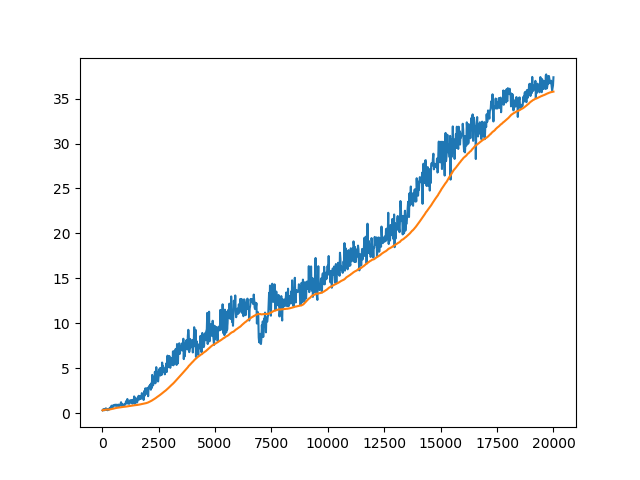

Reacher Project Report
======================

This report describes my solution to the reacher environment provided by Udacity.  See the file README.md for a description of the environment.

Learning Algorithm
------------------

I solved the environment by implementing PPO with separate actor and critic networks.  Both networks had a single hidden layer with 400 nodes.  The actor network' action distribution is normal.  I wrapped the environment so that it could accept any real-valued action and internally converts the action into (-1,1) using the tanh function.  My PPO agent used the following parameters:

policy optimizer: Adam, learning rate 3e-4
value optimizer: Adam, learning rate 3e-4
discount rate: .9
lambda for GAE: 0.
updates per episode (each episode having 20 separate episodes within): 10
epsilon (for clipping): .1
expected minibatch size per update: 15000

Plot of Rewards
---------------

The parameters for my final fitted model are stored in the pickle file checkoint.pth.  The following plot shows average reward per episode at each iteration of training.  The x-axis is number of episodes of experience, where each iteration includes 20 episodes.  The plot also shows average reward over the last 100 training iterations.  I ran 1000 iterations of training, which was sufficient to reach the goal of an average reward of 30 over 100 episodes.  

Ideas for Future Work
---------------------

Tuning the hyperparameters would likely result in faster learning.  A high initial learning rate that decreases adaptively might give good performance.  Additionally, I would like to experiment with different network architectures, possibly with shared parameters.  

